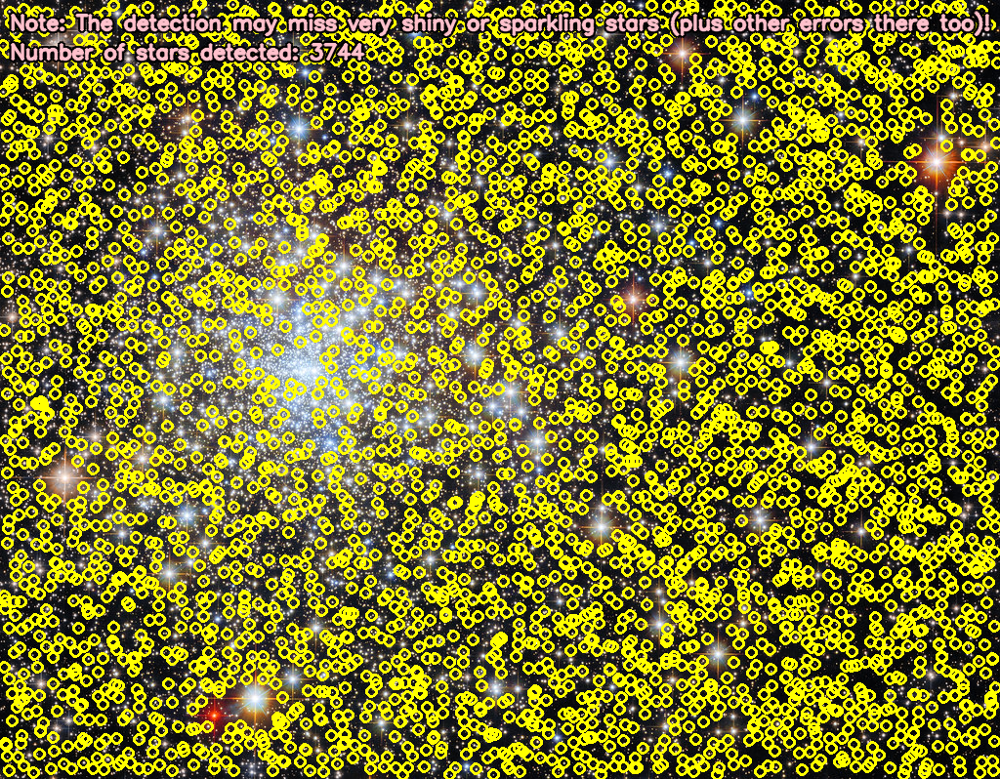

## Star Detection

This repository contains a Python project that fetches images from NASA's Hubble's Star Clusters Flickr album, enhances their contrast, detects stars, and overlays the results with annotations.

## Features

- Fetches images from NASA's Hubble's Star Clusters Flickr album.
- Enhances image contrast using histogram equalization.
- Detects stars in the images using image processing techniques.
- Overlays detected stars and annotations onto the images.

## Dependencies

- `requests`
- `opencv-python`
- `numpy`

You can install the required dependencies using the following command:

```sh
pip install -r requirements.txt
```

## Usage

1. **Clone the repository**:

    ```sh
    git clone https://github.com/Parth-Sidhu-4/Star-Detection.git
    cd star-detection
    ```

2. **Create a `requirements.txt` file** with the following content:

    ```plaintext
    requests
    opencv-python
    numpy
    ```

3. **Run the script**:

    ```sh
    python NASA.py
    ```

## How It Works

1. **Fetch Images**: The script fetches image URLs from NASA's Hubble's Star Clusters Flickr album using the Flickr API.

2. **Download Image**: Downloads a randomly selected image from the fetched URLs.

3. **Enhance Contrast**: Enhances the contrast of the image using histogram equalization in the LAB color space.

4. **Detect Stars**: Detects stars in the image using Gaussian blurring, adaptive thresholding, and morphological operations.

5. **Overlay Results**: Overlays detected stars and annotation text onto the original image and saves the final result as `final_result.png`.

## Example Output

Here is an example of the final annotated image with detected stars:



## License

This project is licensed under the MIT License - see the [LICENSE](LICENSE) file for details.

## Contributing

Contributions are welcome! Please open an issue or submit a pull request for any improvements or bug fixes.

## Acknowledgments

- NASA for the Hubble's Star Clusters images.
- OpenCV for the image processing library.
- Flickr for providing the API to fetch images.

